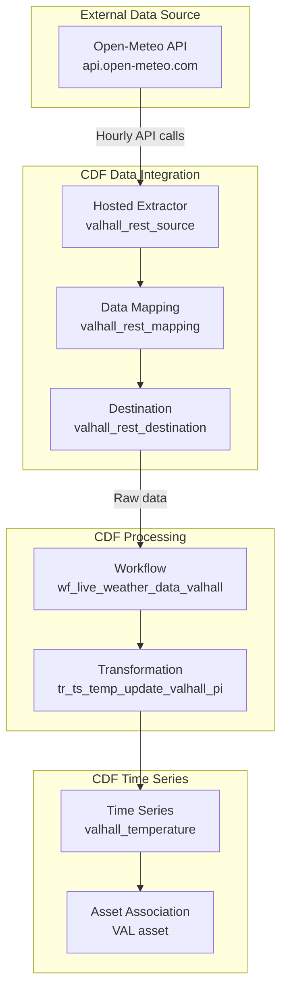

# Live Weather Data Module

A comprehensive data integration module that collects real-time temperature data from the Valhall oil platform using hosted REST extractors and processes it into structured time series data.

## Overview

This module creates a complete pipeline for collecting environmental temperature data from the Valhall oil platform in the North Sea, transforming it into structured time series data, and making it available for analytics and monitoring applications.

## How to Find Components in the CDF UI

### A) Extraction Pipeline (Hosted Connector)

1. **Navigate to**: **Data Integration** → **Extraction pipelines** → **Hosted extractors** tab
2. **Look for**: `valhall_rest_source` (visible in the list with throughput: 1223 datapoints p/hr)
3. **Click on**: `valhall_rest_source` to see job details and configuration
4. **Verify**: Status shows "Connected" and "Currently running" with 100.00% uptime

### B) Data Workflow

1. **Navigate to**: **Data Integration** → **Data workflows**
2. **Look for**: `wf_live_weather_data_valhall` (description: "Live weather data transformation for valhall")
3. **Click on**: The workflow to see execution history and status
4. **Verify**: Workflow is processing data after hosted extractor completes

### C) Data Explorer

1. **Navigate to**: **Data Explorer** → **Time series** tab
2. **Search for**: `valhall_temperature`
3. **Verify**: Time series exists with temperature data

### D) Main Search UI

1. **Navigate to**: **Search** (main search interface)
2. **Search for**: `valhall`
3. **Filter by**: **Time series** (should show 1 result)
4. **Results**: `valhall_temperature` with description "valhall temperature", source unit "degC", and preview chart

## Architecture & Configuration

### Data Flow


### Configuration Files

#### 1. Hosted Extractor Configuration
- **`rest.Source.yaml`**: Defines the source connection to Open-Meteo API
- **`rest.Destination.yaml`**: Configures CDF destination with authentication
- **`rest.Mapping.yaml`**: Maps API response to CDF data points
- **`rest.Job.yaml`**: Defines hourly execution schedule and parameters

#### 2. Workflow Configuration
- **`live_weather_data.Workflow.yaml`**: Main workflow definition
- **`live_weather_data.WorkflowVersion.yaml`**: Workflow version with transformation tasks

#### 3. Transformation Configuration
- **`tr_update_temp_ts.Transformation.yaml`**: Transformation metadata
- **`tr_update_temp_ts.Transformation.sql`**: SQL transformation logic

### Key Configuration Variables
- **`default_location`**: Location identifier (e.g., "valhall")
- **`source_timeseries`**: Source system identifier (e.g., "pi")
- **`IDP_CLIENT_ID`** / **`IDP_CLIENT_SECRET`**: CDF authentication credentials

### Deployment Integration
The module integrates with the main deployment system through:
- **`config.all.yaml`**: Module selection and environment configuration
- **Variable substitution**: `{{ default_location }}` becomes "valhall"
- **CDF Toolkit**: `cdf build` and `cdf deploy` commands

## Creating a New Location Module

### Step 1: Update Configuration
1. **Edit `config.all.yaml`**:
   ```yaml
   variables:
     default_location: new_location  # Change from "valhall" to your location
   ```

### Step 2: Update API Parameters
1. **Edit `rest.Job.yaml`**:
   ```yaml
   config:
     query: {
       "latitude": "YOUR_LATITUDE",
       "longitude": "YOUR_LONGITUDE", 
       "hourly": "temperature_2m",
       "past_days": "90"
     }
   ```

### Step 3: Update Asset Association
1. **Edit `tr_update_temp_ts.Transformation.sql`**:
   ```sql
   array(node_reference("{{ default_location }}-assets", "YOUR_ASSET_ID")) as assets
   ```

### Step 4: Verify
1. **Check extraction pipeline**: Look for `new_location_rest_source`
2. **Check workflow**: Look for `wf_live_weather_data_new_location`
3. **Check time series**: Look for `new_location_temperature`

## Data Characteristics

- **Location**: Configurable (default: Valhall oil platform)
- **Coordinates**: Configurable latitude/longitude
- **Frequency**: Hourly measurements
- **Unit**: Celsius (°C)
- **History**: 90 days of historical data
- **Real-time**: Continuous hourly updates
- **Context**: Associated with platform assets

## Dependencies

- **Foundation Module**: Required for basic CDF setup
- **Valhall Data Model**: Required for asset associations
- **CDF Authentication**: Requires valid IDP credentials

## Usage Examples

### Accessing Temperature Data via CDF Client
```python
from cognite.client import CogniteClient

client = CogniteClient()

# Get temperature time series
ts = client.time_series.retrieve(external_id="valhall_temperature")

# Get recent temperature data
data = client.time_series.data.retrieve(
    external_id="valhall_temperature",
    start="1d-ago",
    end="now"
)
```

### Using in Streamlit Applications
```python
import streamlit as st
from cognite.client import CogniteClient

client = CogniteClient()

# Display current temperature
data = client.time_series.data.retrieve(
    external_id="valhall_temperature",
    start="1h-ago",
    end="now"
)

if data:
    latest_temp = data[0].value
    st.metric("Valhall Temperature", f"{latest_temp}°C")
```

## Monitoring & Troubleshooting

### Check Hosted Extractor Status
- Navigate to **Data Integration** → **Extraction pipelines** → **Hosted extractors**
- Verify `valhall_rest_source` shows "Connected" and "Currently running"
- Check throughput and last modified timestamps

### Check Workflow Execution
- Navigate to **Data Integration** → **Data workflows**
- Verify `wf_live_weather_data_valhall` is executing successfully
- Check execution history for any errors

### Check Time Series Data
- Navigate to **Search** → search for `valhall` → filter by **Time series**
- Verify `valhall_temperature` exists with recent data
- Check preview chart shows temperature variation over time

### Common Issues
- **API Failures**: Hosted extractor will retry on next scheduled run
- **Authentication Issues**: Check IDP credentials in configuration
- **Data Processing Errors**: Workflow will abort and retry with exponential backoff
- **Asset Association Issues**: Verify data model is deployed

## Performance Considerations

- **Data Volume**: ~24 data points per day per location
- **Storage**: Minimal impact on CDF storage
- **API Limits**: Open-Meteo API has generous rate limits
- **Processing**: Lightweight transformations with minimal compute impact