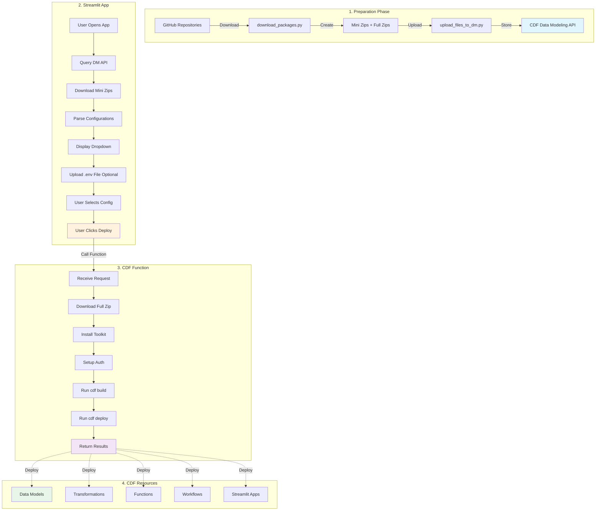

# CDF Package Deployer

A Streamlit application for browsing and deploying Cognite Toolkit configurations from CDF.

## Version

**v2025.10.06.v1** - Switched to Data Modeling API for file discovery using `isUploaded` property

## Overview

The CDF Package Deployer provides a user-friendly interface for:
1. **Discovering** available configurations from mini zip files stored in CDF
2. **Selecting** a configuration to deploy
3. **Uploading** optional environment files (`.env`) for IDP credentials  
4. **Deploying** the selected configuration by calling a CDF Function

## Architecture



## Data Flow

### Phase 1: Package Preparation
1. **GitHub Download**: `download_packages.py` downloads repos from GitHub
2. **Zip Creation**: Creates two types of zips:
   - **Mini Zips**: Contains only `readme.xyz.md` and `config.xyz.yaml` files (~KB)
   - **Full Zips**: Complete repository with all modules (~MB)
3. **Upload to CDF**: `upload_files_to_dm.py` uploads both zip types to CDF Data Modeling API

### Phase 2: User Selection
1. **Discovery**: Streamlit queries Data Modeling API for files in `app-packages` space
2. **Filtering**: Finds all files ending with `-mini.zip` and `isUploaded: True`
3. **Download**: Downloads mini zips using `instance_id` from Data Modeling API
4. **Parsing**: Extracts configuration names and README content from mini zips
5. **Display**: Shows dropdown list of available configurations
6. **Optional .env Upload**: User can upload environment file for IDP credentials

### Phase 3: Deployment
1. **Function Call**: Streamlit calls `test-toolkit-function` with:
   - `zip_name`: Name of full zip to deploy
   - `config_name`: Configuration to use (e.g., `hw-all`)
   - `env_vars`: (Optional) Environment variables from uploaded `.env` file
2. **Function Execution**:
   - Downloads full zip from Data Modeling API
   - Installs Cognite Toolkit
   - Extracts zip and configures authentication
   - Runs `cdf build` with specified config
   - Runs `cdf deploy` with approval
   - Returns build and deploy logs

### Phase 4: CDF Resource Creation
The CDF Function deploys resources to CDF based on the configuration, including:
- Data models and views
- Transformations
- Functions
- Workflows
- Streamlit apps
- RAW tables, datasets, etc.

## Key Components

### Files

- **`main.py`**: Main Streamlit application
- **`requirements.txt`**: Python dependencies

### Functions

#### `get_cdf_client() -> CogniteClient`
Initializes and caches the CogniteClient for connecting to CDF.

#### `download_all_mini_zips(client: CogniteClient) -> List[Dict]`
Queries Data Modeling API for mini zip files in the `app-packages` space and downloads them.

**Returns**: List of configuration dictionaries with:
- `package`: Repository name (e.g., `cognite-quickstart-main`)
- `config`: Configuration name (e.g., `hw-all`)
- `full_zip`: Full zip filename (e.g., `cognite-quickstart-main.zip`)
- `config_file`: Config filename (e.g., `config.hw-all.yaml`)
- `readme_content`: Markdown content of the configuration README

#### `extract_configs_from_mini_zip(zip_content: bytes, zip_name: str) -> List[Dict]`
Parses a mini zip file to extract configuration information from `readme.*.md` files.

#### `call_deploy_function(client: CogniteClient, config: Dict)`
Calls the CDF Function to deploy the selected configuration and displays logs in real-time.

## Usage

### Prerequisites

1. **CDF Authentication**: Set up CDF environment variables or use `.env` file
2. **CDF Function**: `test-toolkit-function` must be deployed
3. **Mini Zips**: Package mini zips must be uploaded to `app-packages` space

### Running the App

```bash
streamlit run main.py
```

### Workflow

1. **Open App**: Navigate to the Streamlit app in your browser
2. **Auto-Load**: App automatically discovers and loads all available configurations
3. **Select Config**: Choose a configuration from the dropdown list
4. **Upload .env (Optional)**: Upload a `.env` file if deploying configurations that need IDP credentials (e.g., hosted extractors)
5. **Deploy**: Click "🚀 Deploy Configuration" button
6. **Monitor**: Watch real-time logs from the CDF Function execution
7. **Verify**: Check CDF to confirm resources were deployed successfully

## Environment Variables

The app uses the following environment variables for CDF authentication:

```bash
CDF_PROJECT=your-project
CDF_CLUSTER=your-cluster
CDF_URL=https://your-cluster.cognitedata.com
IDP_CLIENT_ID=your-client-id
IDP_CLIENT_SECRET=your-client-secret
IDP_TENANT_ID=your-tenant-id
IDP_TOKEN_URL=https://login.microsoftonline.com/your-tenant-id/oauth2/v2.0/token
```

## .env File Upload

The app supports uploading a `.env` file for providing environment variables to the CDF Function. This is useful for:

- **Hosted Extractors**: Providing `IDP_CLIENT_ID`, `IDP_CLIENT_SECRET`, `IDP_TENANT_ID`
- **Transformation Credentials**: Service account credentials for transformations
- **Function Credentials**: OAuth credentials for functions

The uploaded variables are passed as a JSON dictionary to the CDF Function via the `env_vars` parameter.

## Configuration File Format

Mini zips contain configuration-specific README files named `readme.<config>.md` and their corresponding `config.<config>.yaml` files.

**Example**:
- `readme.hw-all.md`: Business-focused description of the "hw-all" configuration
- `config.hw-all.yaml`: Toolkit configuration file

## CDF Function Integration

The app calls the `test-toolkit-function` with this payload:

```json
{
  "zip_name": "cognite-quickstart-main.zip",
  "config_name": "hw-all",
  "env_vars": {
    "IDP_CLIENT_ID": "...",
    "IDP_CLIENT_SECRET": "...",
    "IDP_TENANT_ID": "..."
  }
}
```

The function:
1. Downloads the full zip from CDF Data Modeling API
2. Installs and configures Cognite Toolkit
3. Runs `cdf build --env=hw-all`
4. Runs `cdf deploy --env=hw-all`
5. Returns build and deploy logs

## Data Modeling API

The app uses the **Data Modeling API** (not Files API) to discover and download files. This is the correct approach for files uploaded to spaces.

### Why Data Modeling API?

- Files uploaded with `space:` in `CogniteFile.yaml` are stored as data model instances
- Files API doesn't reliably sync with data model instances
- Data Modeling API provides `isUploaded` property for filtering
- Downloads use `instance_id` parameter: `client.files.download_bytes(instance_id=NodeId(space, external_id))`

### Query Pattern

```python
from cognite.client.data_classes.data_modeling.ids import ViewId, NodeId

view_id = ViewId(space="cdf_cdm", external_id="CogniteFile", version="v1")

instances = client.data_modeling.instances.list(
    instance_type="node",
    sources=view_id,
    space="app-packages",
    limit=1000
)

# Filter for uploaded mini zips
for instance in instances:
    props = instance.properties.get(view_id, {})
    name = props.get("name", "")
    is_uploaded = props.get("isUploaded", False)
    
    if name.endswith("-mini.zip") and is_uploaded:
        # Download using instance_id
        instance_id = NodeId(space=instance.space, external_id=instance.external_id)
        content = client.files.download_bytes(instance_id=instance_id)
```

## Troubleshooting

### No configurations found
- **Cause**: Mini zips not uploaded or `isUploaded: False`
- **Solution**: Run `upload_files_to_dm.py` to upload mini zips

### Files not found during download
- **Cause**: Files not properly uploaded to Data Modeling API
- **Solution**: Verify files exist with `isUploaded: True` in CDF UI

### Function call fails
- **Cause**: Function not deployed or authentication issues
- **Solution**: 
  1. Verify `test-toolkit-function` is deployed
  2. Check CDF permissions
  3. Ensure correct environment is active (`cdfenv <project>`)

### Deploy fails in function
- **Cause**: Invalid configuration or missing resources
- **Solution**: Check function logs for detailed error messages

## Related Documentation

- **[upload_files_to_dm.py README](../../../app-packages-zips/scripts/README_upload_files_to_dm.md)**: How to upload zip files to CDF
- **[download_packages.py](../../../app-packages-zips/scripts/download_packages.py)**: How to create zip files from GitHub
- **[test-toolkit-function handler.py](../../../test-toolkit-api/functions/test-toolkit-function/handler.py)**: CDF Function implementation

## Version History

- **2025.10.06.v1**: Switched to Data Modeling API for file discovery using `isUploaded` property
- **2025.10.06.v0**: Added `.env` file upload functionality
- **2025.10.05.v7**: Fixed file discovery using Files API with `uploaded` filter
- **2025.10.05.v5**: Automatic mini zip download and configuration selection
- **Earlier versions**: Multi-step workflow (deprecated)
